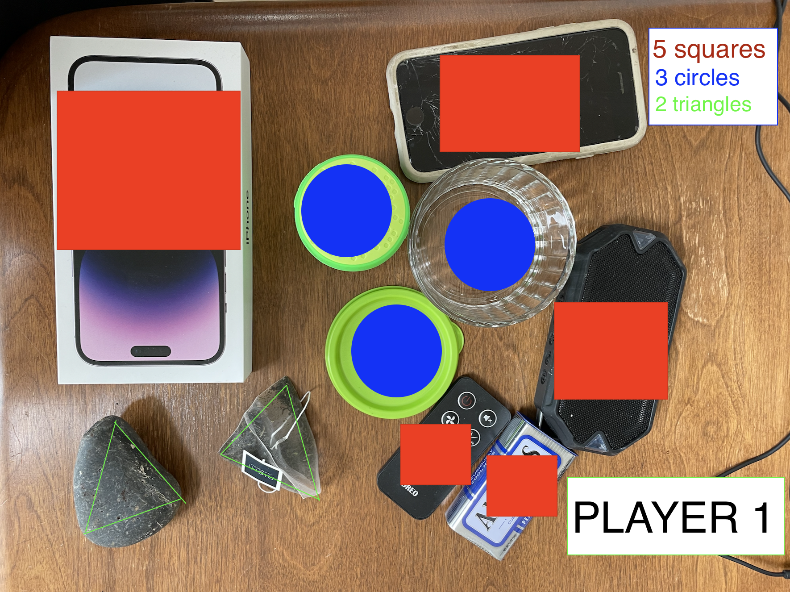
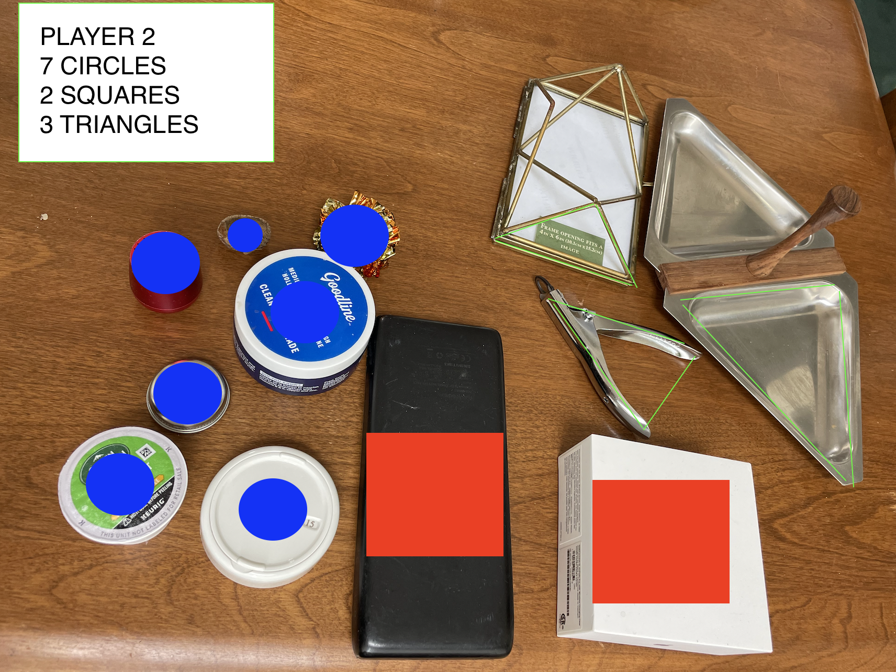

# Geometric Equations
Jennah Kanan

CPSC 386

05/03/2023

Jkanan@csu.fullerton.edu

The purpose of this game is to strengthen your math skills while also having fun!

2+ players 
Items: anything you find in your house/area

Instructions 
1. Go around your house (or where ever you are) and collect anything thats a circle, triangle, or square in 120 seconds. For the purpose of this game, rectangle = square. 
2. play rock paper scissors, whoever wins forms an equation. For example, it can be triangle + circle - square = answer, or tiangle * square + circle = answer. Whoever has the largest number, wins one point. 
3. each round decrease the time by 5 seconds.
4. Keep track of the score until one player reaches 10 points. That player wins.  

Tutorial
* In this example, we have 2 players. 
* Each player will go around their house and find everything thats a circle, triangle, or square in the alloted time. In this case, it's the beginning of the game, so it's 120 seconds. 

PLAYER 1 

PLAYER 2

* Then, the players will play rock paper scissors. 
* Player 1 wins the rock paper scissors, and makes up the equation : triangle squares + circles / triangles = answer 
* The first player will be: 5+3/2 = 4, the second player will be 7+2/3 = 3. 
* The first player wins this round! So, the first player recieves 1 point.
Now, keep playing this game by decreasing the time to search by 5 seconds each round until one player reaches 10 points. 
